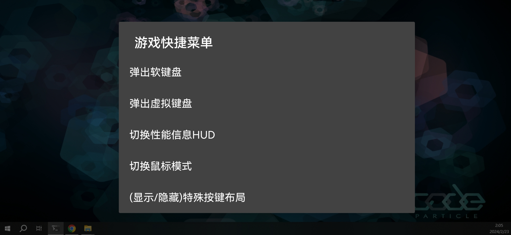
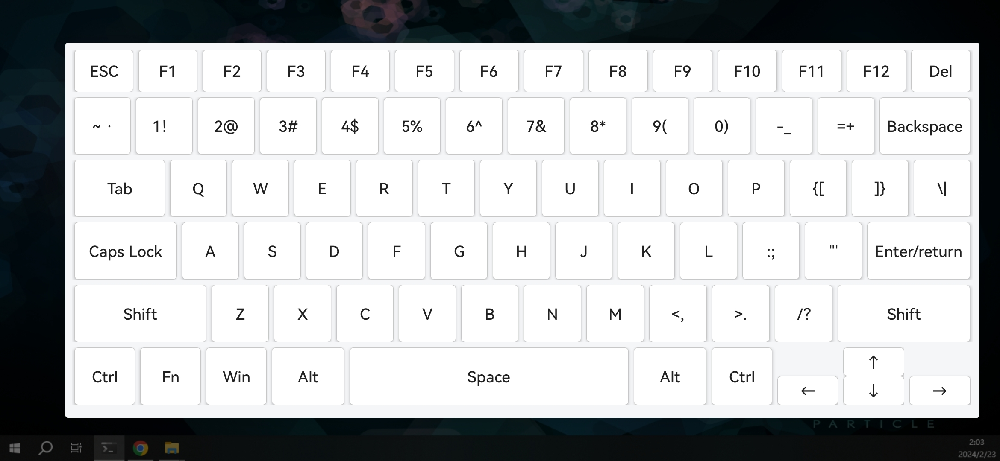

# 重要！
**本项目暂停更新，使命结束啦，阿西西版本现已内置虚拟键盘。**

# moonlight-android 虚拟键盘魔改脚本

> 魔改初衷: 我是重度使用原神触摸版，几乎不玩其他游戏和手柄游戏。阿西西支持多点触控，在触控模式下，我因为虚拟显示器问题，我需要切换sunshine显示屏的需求，但是阿西西特殊按键列表中没有切换显示屏的快捷键，所以增加一个通用虚拟键盘，如果有一样需求的可以临时用一下这个版本，希望阿西西能内置此功能。

本项目是基于moonlight-android阿西西最新版本进行逆向魔改增加虚拟键盘功能。

由于阿西西版本未开源，所以本项目主要采用逆向方式进行魔改。已实现脚本自动化patch。

## 功能
- 返回时弹出菜单增加了虚拟键盘。特殊按键列表里没有的可以临时用一下这个版本。
- 虚拟键盘透明

## 成品
请访问[Release](https://github.com/HaliComing/moonlight-android-axi-l/releases)页面下载

国内下载加速，请访问GitHub 文件加速https://ghproxy.markxu.online/

## 想自己Patch？
- Java环境：JDK8
- 系统：Windows10
- 终端：Git Bash
- 签名文件：android.jks
- 阿西西版本apk：[https://www.123pan.com/s/OavtVv-CcpJA.html](https://www.123pan.com/s/OavtVv-CcpJA.html) 提取码:axix

将下载的apk重命名为`moonlight.apk`后放在项目目录下。

使用Android Studio工具创建jks文件，网上资料比较多，创建后将jks重命名为`android.jks`后放在项目目录下，名字密码都是`android`，脚本参数为`--ks-key-alias android --ks-pass pass:android --key-pass pass:android`，如果不一致修改一下patch.sh里对应的地方即可。

准备就绪后在Git Bash环境下输入`./patch.sh`等待执行完成会有一个名为`moonlight_patch_align_sign.apk`的apk就是输出产物。

## 使命
希望作者内置进阿西西版本或阿西西版本开源后，本程序预计也会随即停止更新。(:逆向加功能不难就是麻烦累

## 参考

虚拟键盘布局源码来自 https://github.com/AoEiuV020/HidRemote
